# Kesit akışı — ilk kez kullanan gözüyle denetim

> Tarih: 2026-09-30 · Kapsam: ADR-026 (kesit listesi) + ADR-027 (hızlı kesim) sonrası editör,
> açılış sayfası. Yöntem: uygulamayı hiç görmemiş biri gibi `docs/beta/USER_TEST_KIT.md`
> görevlerini yürümek, her adımda ekran görüntüsü, Nielsen'in 10 ilkesi, yeni ve değişen her şeyde
> WCAG 2.2 AA. **Gerçek kullanıcı testi değildir**; kitteki oturumların yerine geçmez, onlardan önce
> bariz tıkanmaları temizler.

## Nasıl yapıldı

- Betik: `web/scripts/ux-audit.mjs` (yeniden koşulabilir). Çalışan uygulama (`next start`), Playwright
  Chromium, dört boyut: **masaüstü 1440×900**, **dizüstü 1280×720**, **tablet 820×1180 dokunmatik**,
  **telefon 390×844 dokunmatik + mobil**. Yerel test videosu (`tests/media/sample-24s.mp4`,
  1280×720, 24 sn); kaydetme penceresi e2e testlerindeki gibi sayfanın kendi deposuna (OPFS) yazan
  bir yedekle değiştirildi. Hiçbir şey makineden çıkmadı.
- Adımlar (her boyutta): açılış sayfası → boş editör → video aç → şeride tıkla + Başlangıç → şeride
  tıkla + Bitiş → Kesit ekle → kartın ⬇'ı (ilerleme, sonuç) → iki kesit daha → bir kesiti seç →
  Ayarlar → Diğer → ters aralık reddi → hepsini birleştirip indir → video olmayan dosya → kaydetme
  penceresi olmayan tarayıcı (Firefox/Safari yolu; masaüstü ve telefon).
- Her adımda ölçülen: 44×44 CSS px'ten küçük denetimler (belge 06 politikası) ve 24×24'ten küçükler
  (WCAG 2.2 AA 2.5.8), ekranda görünen teknik kelimeler (GiB/MiB, fps, codec, H.264, AAC, encode,
  kodla…). Ham veri: `2026-09-30/before-measurements.json`, `2026-09-30/after-measurements.json`.
- Ekran görüntüleri: `docs/ux/2026-09-30/{before|after}-{desktop|laptop|tablet|phone}-NN-adım.png`
  (önce: değişiklikten önceki derleme `2a369a6`; sonra: bu dal).

Önem dereceleri: **engeller** (ilk kez gelen kişi yardımsız geçemeyebilir ya da yanlış şeyi yapar),
**yavaşlatır** (duraksar, arar, yanlış tıklar ama bulur), **kozmetik**.

## Önce / sonra: ana ekranlar

| | Önce | Sonra |
|---|---|---|
| Masaüstü, video açık | 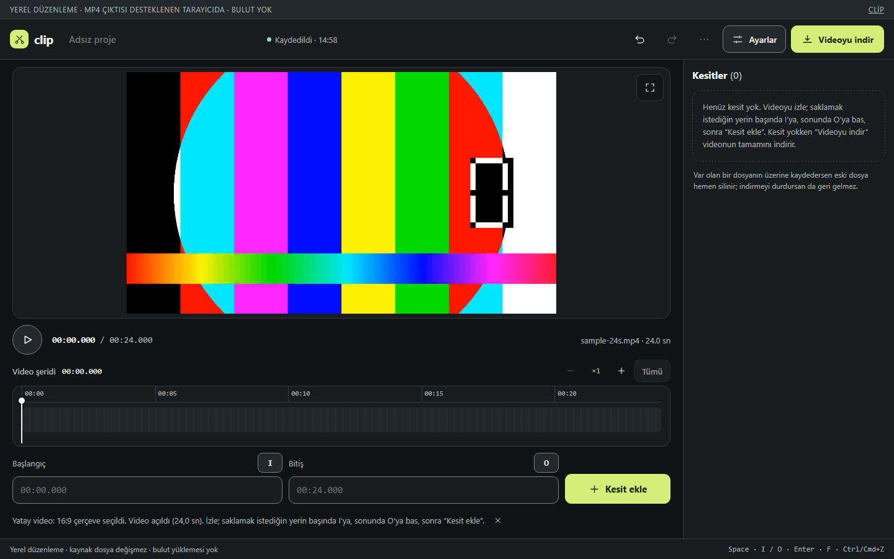 | 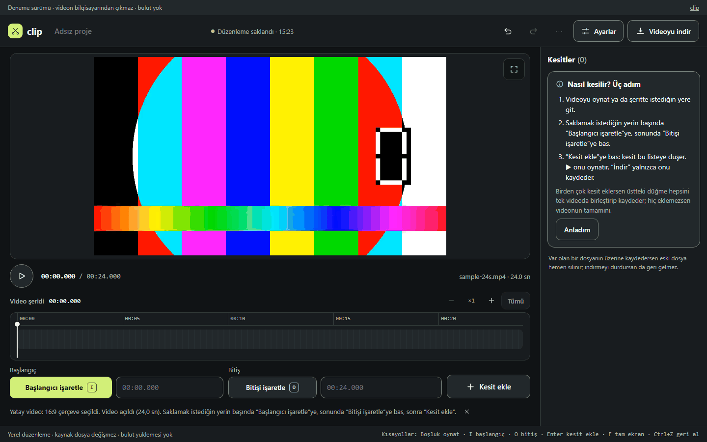 |
| Masaüstü, başlangıç işaretli | 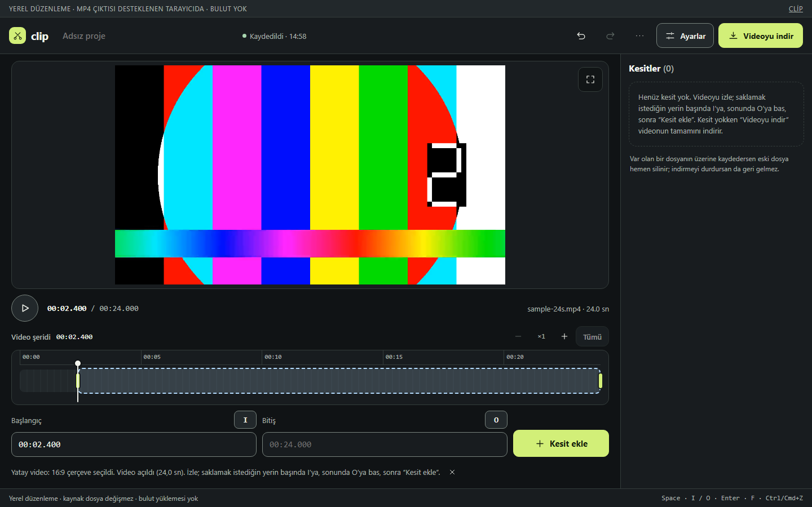 | 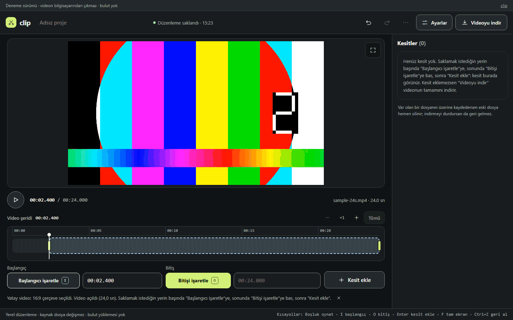 |
| Masaüstü, kesit kaydedildi | 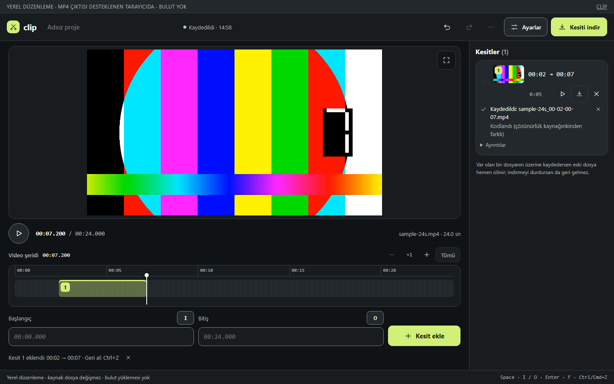 | 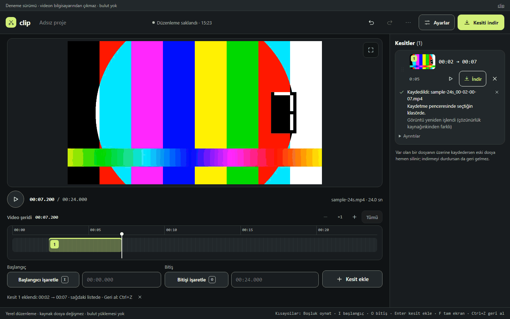 |
| Masaüstü, üç kesit | 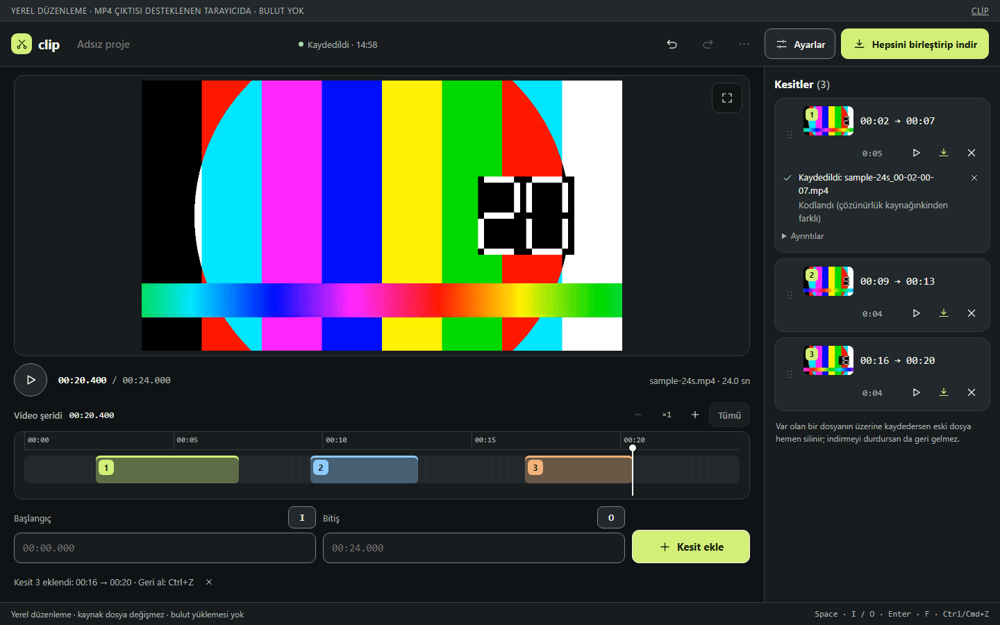 | 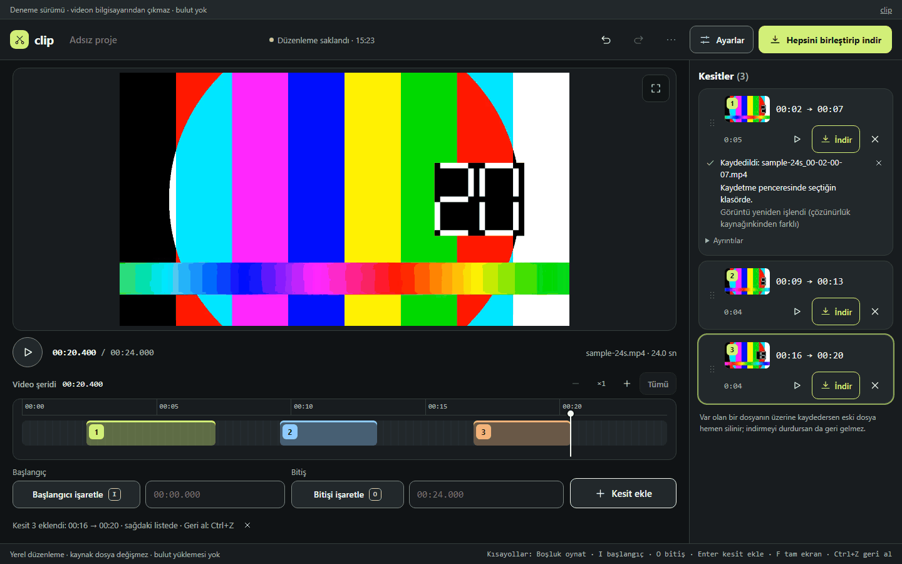 |
| Telefon, video açık | 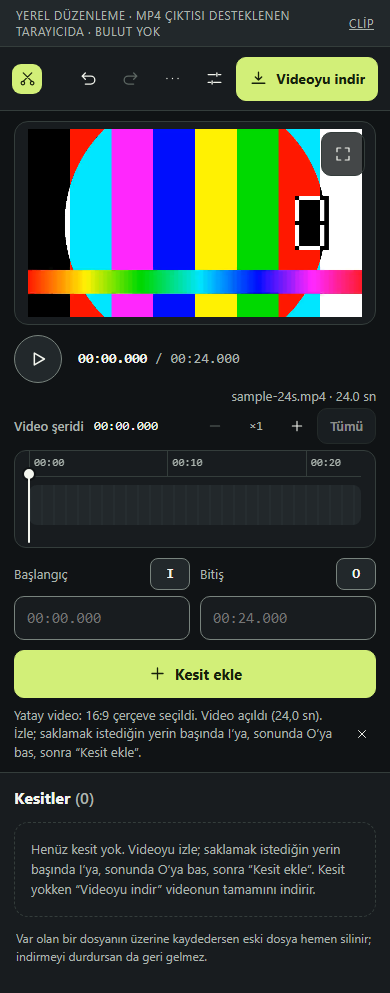 | 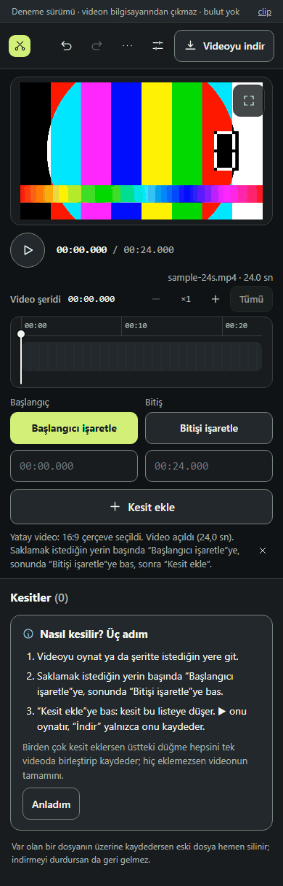 |
| Telefon, kesit eklendi | 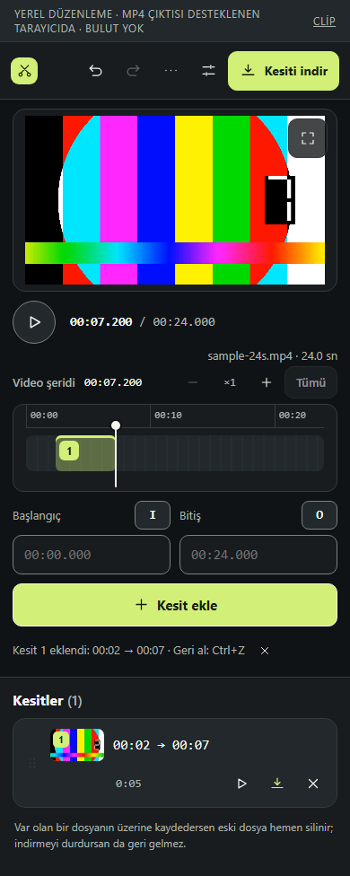 | 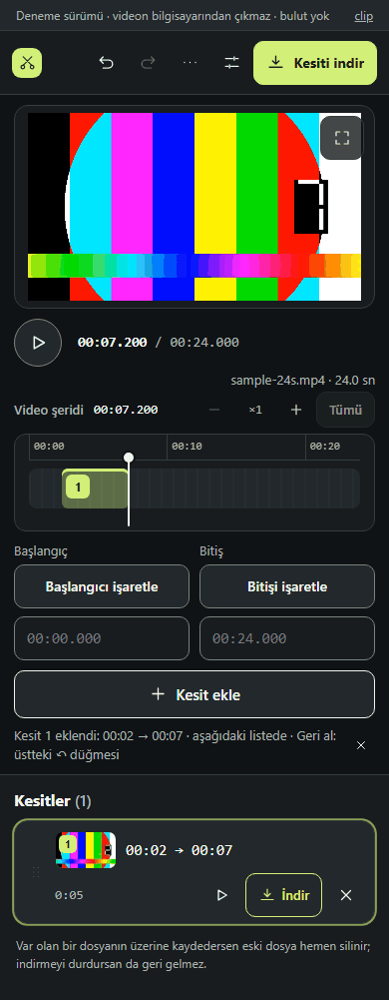 |
| Telefon, kaydedildi | 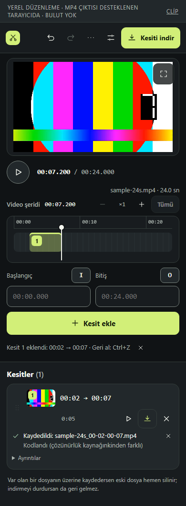 | 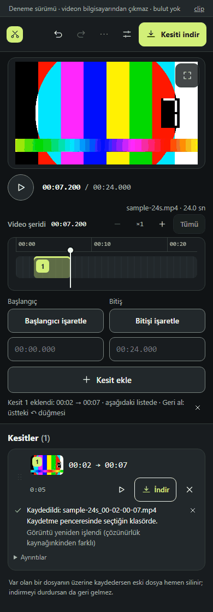 |
| Açılış sayfası | 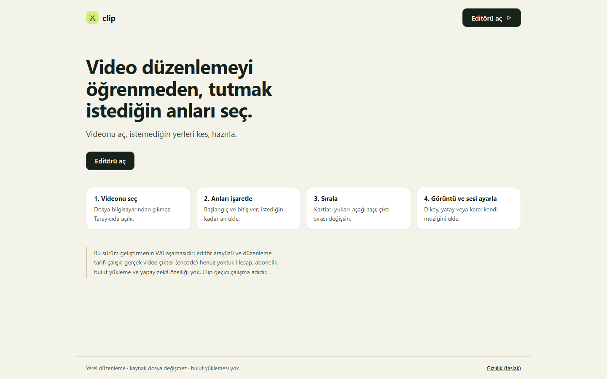 | 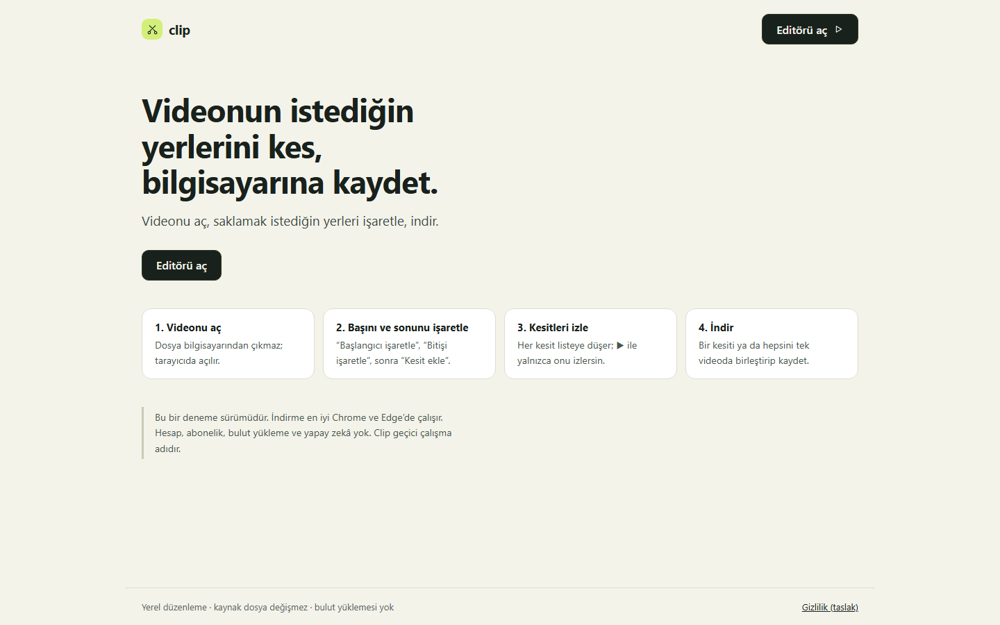 |

## Bulgular

"Durum": **düzeltildi** (bu dalda), **kısmen**, **öneri** (kurucu kararı ya da yapısal iş; aşağıda).

### Engeller

| # | Ne gördüm (ilk kez gelen kişi olarak) | Ekran | Düzeltme | Durum |
|---|---|---|---|---|
| E1 | **Nereden işaretlerim?** Başlangıç/Bitiş düğmeleri yalnızca "I" ve "O" harfleri: tuş kapağına benziyor, etiketin öbür ucunda, düğme olduğu belli değil. Yönlendirme metinleri "başında I'ya, sonunda O'ya bas" diyor — telefonda ve tablette klavye yok, bu cümle anlamsız. | `before-desktop-02-video-open.png`, `before-phone-02-video-open.png` | Düğmeler sözle: **"Başlangıcı işaretle"**, **"Bitişi işaretle"** (44 px, belge 05 F01'in "Başlangıcı işaretle" ifadesi). Tuş küçük bir ipucu olarak yanında (`aria-keyshortcuts`), dokunmatikte gizli. Açılış bildirimi, boş liste, yardım metinleri düğme adlarını söylüyor. | düzeltildi |
| E2 | **İlk ne yapacağım belli değil.** Video açılınca iki yeşil (birincil) düğme var: sağ üstte "Videoyu indir", altta "Kesit ekle". En göze çarpan "Videoyu indir": basan kişi hiçbir şey kesmeden tüm videoyu indirir. | `before-desktop-02-video-open.png` | **Tek birincil düğme = sıradaki adım:** hiçbir şey işaretli değilken "Başlangıcı işaretle", sonra "Bitişi işaretle", sonra "Kesit ekle"; kesit varken sağ üstteki indirme. Kesit yokken "Videoyu indir" ikincil (çerçeveli). | düzeltildi |
| E3 | **Açılış sayfası yanlış ve eski.** "Bu sürüm … W0 aşamasıdır … gerçek video çıktısı (encode) henüz yoktur", adımlar "Anları işaretle / Sırala" (eski model), alt başlık "istemediğin yerleri kes" (kesit modelinin tersi). İlk ziyaretçi indirme yapılamadığını düşünür. Metinler koda gömülüydü (belge 06: gömülü metin yok). | `before-desktop-00-landing.png` | Güncel akış dört adımda, düğme adlarıyla; not "deneme sürümü, indirme en iyi Chrome ve Edge'de". Metinler `messages.ts`'e (tr/en) taşındı. | düzeltildi |

### Yavaşlatır

| # | Ne gördüm | Ekran | Düzeltme | Durum |
|---|---|---|---|---|
| Y1 | **Kesit eklendi mi, nereye?** Bildirim altta solda, kesit sağ üstte belirir; göz aradaki yolu bilmiyor. Telefonda liste ekranın altında (görünmüyor) ve bildirim "Geri al: Ctrl+Z" diyor. | `before-desktop-05-kesit-added.png`, `before-phone-05-kesit-added.png` | Bildirim yeri söylüyor: "… · sağdaki listede · Geri al: Ctrl+Z"; telefonda "… · aşağıdaki listede · Geri al: üstteki ↶ düğmesi" (silmede de). Yeni kart bir kez parlıyor (azaltılmış harekette yok). | kısmen (telefonda listeye götürme: Ö3) |
| Y2 | **"Kaydedildi: dosya.mp4" — nereye?** Tarayıcı indirmesine alışan kişi İndirilenler'de arar; dosya ise kaydetme penceresinde seçilen klasörde. Pencere olmayan yolda "Bilgisayara kaydet"ten sonra da nereye gittiği yazmıyor. | `before-desktop-07-saved.png`, `before-desktop-15-no-save-dialog.png` | Altına **"Kaydetme penceresinde seçtiğin klasörde."** (sayfa klasörün yolunu bilemez, API vermiyor; hangi klasör olduğunu söyleyebilir). Ekran okuyucu duyurusu da bunu söylüyor. Pencere yoksa: "Tarayıcın dosyayı İndirilenler klasörüne kaydeder (ya da nereye kaydedeceğini sorar)." | düzeltildi |
| Y3 | **İki ayrı "Kaydedildi".** Video açılır açılmaz üstte "Kaydedildi · 14:49" (proje tarifinin tarayıcıya kaydı) — "videom kaydedildi mi?" Boş editörde "Henüz kaydedilmedi" de bir şey yapmam gerekiyormuş gibi okunuyor. | `before-desktop-02-video-open.png` | Rozet **"Düzenleme saklandı · 14:49"** / "Düzenleme henüz saklanmadı" / "saklanıyor…" / "saklanamadı". "Kaydedildi" artık yalnızca indirilen dosya için. | düzeltildi |
| Y4 | **Hangi düğme neyi indirir?** Kartta ▶ ⬇ ✕ yalnızca simge (40 px), üzerine gelince açıklama yok; ⬇'ın yalnız o kesiti, sağ üstün hepsini indirdiği anlaşılmıyor (kitte ayrıca sorulan soru). | `before-desktop-08-three-kesits.png` | Kartın indirme düğmesi **"İndir"** yazılı ve vurgulu; ▶/⬇/✕ için balon: "Bu kesiti oynat", "Yalnızca bu kesiti indir", "Bu kesiti sil"; 44 px. İlk kullanım ipucu farkı söylüyor ("İndir yalnızca onu kaydeder"; "üstteki düğme hepsini birleştirip kaydeder"). | düzeltildi |
| Y5 | **Teknik dil.** "Kodlandı (çözünürlük kaynağınkinden farklı)" en sık durumda çıkıyor ve bir uyarı gibi okunuyor; "Kareler kodlanıyor"; Ayarlar'da "Hedef kalite 1080p · H.264 / AAC" ve geliştirici notu "Bu çerçeveleme tarifi önizleme ve çıktıda aynı hesaptan gelir…"; fps gerekçesi. | `before-desktop-07-saved.png`, `before-desktop-10-settings.png`, `before-desktop-06-downloading.png` | "Görüntü yeniden işlendi (…)", "Video oluşturuluyor", "Hazırlanıyor…", "Dosya tamamlanıyor…", "İndirme kalitesi: 1080p (Full HD) / 720p (HD)", "Önizlemede gördüğün çerçeve, indirilen videoda da aynen olur.", "kaynak saniyede 30 kareden hızlı, 30 kareye indirildi". | kısmen (MiB, ADR-027 satırı: Ö6, Ö7) |
| Y6 | **Ret metinleri sonraki adımı söylemiyor.** "Bitiş zamanı başlangıçtan sonra olmalı." — peki ne yapayım? Video olmayan dosyada "önizlemesi açılamadı … formatı oynatmıyor" ve orada biter. | `before-desktop-12-refusal-reversed.png`, `before-desktop-14-not-a-video.png` | İşaretlerin reddine sonraki adım eklendi: "Bitişi düzelt ya da videoda daha ileri gidip “Bitişi işaretle”ye bas." (ayrıca ekran dışı zaman ve çok kısa kesit için). Önizleme hatası: "Başka bir video dene; telefonla çekilmiş MP4 ya da MOV dosyaları genelde açılır." (Aynı hata anahtarları Ayarlar'daki müzik aralığından da gelir; öneri yalnızca işaretlerin reddinde görünür.) | düzeltildi |
| Y7 | **Adım adım yol yok.** İlk kez gelen için tek rehber alttaki soluk bildirim satırı ve boş listedeki tuş cümlesi. | `before-desktop-01-editor-empty.png` | **İlk kullanım ipucu** boş listenin yerinde: "Nasıl kesilir? Üç adım" + "Anladım". Kapatılınca `localStorage`'da hatırlanır (okuma/yazma `try/catch`; depolama reddedilirse ipucu yine görünür ve "Anladım" onu o sayfada gizler). Odak "Kesitler" başlığına döner. Gizlilik sayfası ve `docs/privacy/DATA_INVENTORY.md` bu tek anahtarı listeliyor (önce "localStorage kullanılmaz" diyordu). | düzeltildi |
| Y8 | **Alt çubuk:** "Space · I / O · Enter · F · Ctrl/Cmd+Z" — İngilizce, ne işe yaradıkları yok, metin koda gömülü. | `before-desktop-02-video-open.png` | "Kısayollar: Boşluk oynat · I başlangıç · O bitiş · Enter kesit ekle · F tam ekran · Ctrl+Z geri al" (tr/en mesajlardan); 1100 px altında gizli (Diğer → Kısayollar ve sınırlar'da var). | düzeltildi |
| Y9 | **Ayarlar'da ne var?** Kit görev 1: "dikey video hazırla" — 9:16'nın Ayarlar'da olduğu düğmeden anlaşılmıyor; telefonda Ayarlar yalnızca simge. | `before-phone-02-video-open.png` | Ayarlar ve ⋯ düğmelerine açıklama balonu ("Çerçeve (dikey, yatay, kare), kalite, ses, müzik ve altyazı"; "Başka video aç, sessizlikleri bul, yedek, yardım"). Dokunmatikte balon yok. | kısmen (Ö11) |
| Y10 | **Sağ üst düğmenin adı kesit sayısıyla değişiyor** (Videoyu indir → Kesiti indir → Hepsini birleştirip indir); değiştiğini fark etmeyen kişi ne indireceğini bilmez. | `before-desktop-05-kesit-added.png` | Birincil vurgu artık kesit olunca bu düğmeye geçiyor (dikkat çekiyor). | kısmen (Ö4) |
| Y11 | **Hiçbir şey işaretlemeden "Kesit ekle"** videonun tamamını kesit yapar; bir şey söylemez. | — | Artık bu durumda "Kesit ekle" birincil değil. | öneri (Ö5) |

### Kozmetik

| # | Ne gördüm | Ekran | Düzeltme | Durum |
|---|---|---|---|---|
| K1 | Üst şerit büyük harfle ("YEREL DÜZENLEME · MP4 ÇIKTISI DESTEKLENEN TARAYICIDA") ve bağlantı "CLİP" (Türkçe büyük i); alttaki çubuk aynı şeyi tekrarlıyor. | `before-desktop-01-editor-empty.png` | Büyük harf kaldırıldı; "Deneme sürümü · videon bilgisayarından çıkmaz · bulut yok". | düzeltildi |
| K2 | Şerit üstündeki kesit numarası çipleri 22×22 px (24'ün altında; liste eşdeğer denetim olduğu için 2.5.8 istisnasına giriyordu). | measurements | 24×24. | düzeltildi |
| K3 | Kart tutamacı (⋮⋮) çok soluk; tek kesitte devre dışı; sürükleyerek sıralama keşfedilmiyor. | `before-desktop-08-three-kesits.png` | — | öneri (Ö10) |
| K4 | Zaman üç yerde, milisaniyeyle ("00:07.200"): oynatıcı, şerit başlığı, alanlar. | `before-desktop-04-end-marked.png` | — | öneri (Ö8) |
| K5 | "Var olan bir dosyanın üzerine kaydedersen eski dosya hemen silinir…" notu ilk açılıştan itibaren hep görünür; uyarı yorgunluğu. | `before-desktop-02-video-open.png` | — (ADR-026 kararı; metin aynen kaldı) | öneri (Ö9) |
| K6 | Tablette proje adı "Adsız p…" diye kesiliyor. | `before-tablet-08-three-kesits.png` | — | öneri |
| K7 | Şeridin −/+ ve bildirim kapatma düğmeleri 32×32 (24'ün üstünde, 44'ün altında); "Ayrıntılar" 24 px yüksek. | measurements | — | not |
| K8 | Bu dalın yan etkisi: dar alanda (tablet, telefon) işaret satırı iki satır oldu (düğme üstte, zaman altta), telefonda liste ~40 px aşağı indi. İki alan hep aynı biçimde kırılıyor (container query). | `after-phone-02-video-open.png`, `after-tablet-05-kesit-added.png` | — | bilinçli ödünleşim |

## Nielsen'in 10 ilkesi (özet)

| İlke | Önce | Bu dalda |
|---|---|---|
| 1 Sistem durumunun görünürlüğü | İlerleme gerçek kareyle, iyi. Kesitin nereye düştüğü, dosyanın nereye yazıldığı yok; iki "Kaydedildi". | Y1, Y2, Y3 |
| 2 Gerçek dünyayla uyum | "I/O", "Kodlandı", "H.264 / AAC", "fps", "MiB", "encode". | E1, Y5 (MiB kaldı) |
| 3 Kontrol ve özgürlük | Geri al, İptal et, Vazgeç var; telefonda "Ctrl+Z" yönlendirmesi. | Y1 |
| 4 Tutarlılık | Aynı anda iki birincil düğme; "Kaydedildi" iki anlamda. | E2, Y3 |
| 5 Hata önleme | Boş işaretle "Kesit ekle" tüm videoyu ekler; "Videoyu indir" en göze çarpan düğme. | E2 (Ö5 açık) |
| 6 Hatırlamak yerine tanımak | Tuş harfi düğmeler, açıklamasız simgeler. | E1, Y4 |
| 7 Esneklik ve verim | Klavye kısayolları var ama alt çubukta anlamsız. | Y8 |
| 8 Sade tasarım | Büyük harfli şerit, üç zaman göstergesi, sürekli uyarı notu. | K1 (K4, K5 öneri) |
| 9 Hatayı tanıma ve düzeltme | Retler neyin yanlış olduğunu söylüyor, ne yapılacağını değil. | Y6 |
| 10 Yardım | Yardım Diğer → Kısayollar'da; ilk kez gelen için adım yok. | Y7 |

## WCAG 2.2 AA — yeni ve değişen her şey

- **2.5.8 Hedef boyutu (en az):** yeni/değişen denetimler 44 px ("Başlangıcı işaretle", "Bitişi işaretle", kart ▶/İndir/✕, "Anladım"); şerit çipleri 22 → 24 px. 24'ün altında kalanlar: açılış sayfasındaki "Gizlilik (taslak)" (81×17) ve üst şeritteki "clip" bağlantısı (18×16) — ikisi de çevresinde başka hedef olmayan tek bağlantı (aralık istisnası); Ayarlar'daki iki radyo (17×17) tıklanabilir etiket satırlarıyla.
- **2.5.3 Etiketteki ad:** işaret düğmelerinin adı görünen sözün kendisi; tuş `kbd` `aria-hidden`. Kartın "İndir"i: görünen söz adın içinde ("Kesit 1'i indir, 00:02–00:07").
- **3.3.3 Hata önerisi:** Y6.
- **4.1.3 Durum mesajları:** kesit eklendi bildirimi ve indirme sonucu (dosyanın yeri dahil) `role="status"`.
- **2.3.3 / azaltılmış hareket:** yeni kartın parlaması `prefers-reduced-motion: reduce`'ta yok (a11y testi "no animation … when the system asks for less motion" geçti).
- **1.4.10 Yeniden akış, 1.4.12 Metin aralığı, 2.4.7/2.4.11 Odak:** a11y paketi (320 px, 1440/390 px metin aralığı, yalnız klavyeyle akış, odak tuzağı/dönüşü) geçti; "Anladım"dan sonra odak "Kesitler" başlığına gider (kaybolmaz).
- **axe:** masaüstü, tablet, telefon 0 ihlal (a11y paketi).

## Tıklama sayısı (fare; video açık; ADR-026 tanımı)

| Görev | Önce | Sonra |
|---|---|---|
| Bir aralığı kesip kaydet | **7**: şeride tıkla, I, şeride tıkla, O, Kesit ekle, ⬇, penceredeki Kaydet | **7**: şeride tıkla, Başlangıcı işaretle, şeride tıkla, Bitişi işaretle, Kesit ekle, İndir, Kaydet |
| Üç aralığı kesip birleştirilmiş kaydet | **17**: 3 × 5 + Hepsini birleştirip indir + Kaydet | **17** |
| Videonun tamamını kaydet | **2**: Videoyu indir + Kaydet | **2** |

Klavyeyle (her ikisinde): aralık başına I, O, Enter + oynatma çizgisini taşımak. İlk kullanım
ipucunun "Anladım"ı bir kez ve isteğe bağlı (ipucu hiçbir şeyi kapatmaz).

**Tıklama sayısı değişmedi; değişen, her tıklamanın neresi olduğunun bulunması.** Sayıyı azaltmak
akışı değiştirmeyi gerektirir (Ö1: 7 → 6, 17 → 14).

## Kurucuya öneriler (yapısal; bu dalda yapılmadı)

1. **Ö1 — "Bitişi işaretle" kesiti hemen eklesin.** "Kesit ekle" ayrı bir adım olmaktan çıkar
   (başlangıç işaretliyken bitiş = kesit). Tıklama: 7 → 6, 17 → 14. Klavyede O = ekle. Ters/boş
   aralık için bugünkü ret metinleri aynen. Ürün modeli değişikliği olduğu için sorulmadan yapılmadı.
2. **Ö2 — İşaret düğmeleri gözün olduğu yerde.** Oynat düğmesinin yanında, önizlemenin hemen
   altında "[ Başlangıç ] [ Bitiş ]"; zaman alanları "ince ayar"ın içinde.
3. **Ö3 — Telefonda eklenen kesiti göster.** Ya listeye kaydır ya da altta yapışkan bir çubuk:
   "Kesitler (3) · Hepsini indir".
4. **Ö4 — Sağ üst düğmenin ne indireceği sabit görünsün.** Altına küçük satır ("3 kesit · 0:13") ya
   da iki sabit düğme ("Videonun tamamı" / "Kesitleri indir").
5. **Ö5 — İşaretsiz "Kesit ekle".** Ya devre dışı ve nedenini söyleyen ipucu ya da "Videonun tamamı
   kesit olarak eklendi" bildirimi.
6. **Ö6 — "MiB/GiB" yerine "MB/GB".** Biçimleyici alan kodunda (`domain/outputStorage.ts`,
   `domain/policy.ts`) ve birim testlerinde; hata metinleri "4 GiB (yaklaşık 4,29 GB)" gibi ikisini
   birlikte veriyor. Bu dalın kapsamı dışında bırakıldı (alan kodu).
7. **Ö7 — ADR-027 yöntem satırı daha kısa.** Kurucunun onayladığı "Hızlı kesim — görüntü yeniden
   kodlanmadı, orijinal kalite" metni aynen bırakıldı; öneri: "Hızlı kesim: kalite aynı", ayrıntı
   "Ayrıntılar"da. ("Kodlandı" ise "Görüntü yeniden işlendi" oldu.)
8. **Ö8 — Zaman gösterimi.** Üç yerde milisaniyeli saat yerine: oynatıcıda "0:07", alanlarda
   saniyenin onda biri; milisaniye yalnızca ince ayarda.
9. **Ö9 — Üzerine yazma notu.** ADR-026'nın notu her zaman görünüyor; yalnızca ilk indirmeden önce bir
   kez ya da pencereden hemen önce göstermek.
10. **Ö10 — Sıralama keşfi.** Tutamaç daha belirgin ya da kartta "yukarı/aşağı" (belge 05 F02'deki
    "Öne al / Arkaya al").
11. **Ö11 — Telefonda "Ayarlar" sözle.** Yer açmak için geri al/ileri al ⋯ içine alınabilir.
12. **Ö12 — "Örnekle dene".** Belge 05'teki kısa demo videosu: elinde video olmayan ilk ziyaretçi
    akışı deneyebilsin (bize ait küçük bir dosya; yeni üçüncü taraf isteği yok).
13. **Ö13 — Gerçek kullanıcı testi.** Kit hazır; bu denetim bir tahmin, 5–10 kişiyle doğrulanmalı
    (özellikle "kesit" kelimesi, "Başlangıcı işaretle"nin şu anki yeri işaretlediğinin anlaşılması,
    kaydetme penceresi).

## Bu dalda değişenler

- Arayüz: `web/src/components/editor/MarkBar.tsx`, `KesitList.tsx`, `FirstRunHint.tsx` (yeni),
  `DownloadStatus.tsx`, `EditorApp.tsx`, `Inspector.tsx`, `PreviewStage.tsx`, `SaveStateBadge.tsx`,
  `useEditorState.ts` (yalnızca `addKesit` ret nedenini döndürüyor), `web/src/app/page.tsx`,
  `web/src/components/PrivacyPage.tsx`, `web/src/app/editor.css`.
- Metinler: `web/src/i18n/messages.ts` (tr + en).
- Belgeler: `docs/privacy/DATA_INVENTORY.md` (localStorage'daki tek anahtar).
- Testler (tam metinler bilerek güncellendi, gevşetilmedi; yenileri eklendi): `kesit.spec.ts`
  (ilk kullanım ipucu, depolama reddi, birincil düğme sırası, bildirimde yer, dosyanın yeri, ret
  sonrası adım, işaret düğmelerinin adları), `fast-cut.spec.ts`, `persistence.spec.ts`,
  `privacy.spec.ts`, `a11y.spec.ts`, `captions.spec.ts`, `output-limits.spec.ts`.
- Şema, dışa aktarma/worker, ürün modeli: değişmedi. Test kimlikleri (`data-testid`) değişmedi.

## Denenmeyenler

Gerçek kullanıcı; gerçek dokunmatik cihaz (dokunma Chromium öykünmesiyle); gerçek ekran okuyucu;
Firefox/Safari (pencere olmayan yol, pencere API'si kaldırılarak); macOS/Linux kaydetme penceresi;
açık tema (uygulama yalnızca koyu).
